# BEACON: Bayesian Event Assessment for Conjunction Observation and Notification

## Abstract

Satellite conjunction assessment is a rare-event decision-support problem in which operators must prioritize a small number of potentially high-risk events from a much larger set of routine conjunction warnings. This work introduces **BEACON**, a reproducible study of calibrated, uncertainty-aware machine learning for satellite conjunction triage using public conjunction data message data.

BEACON evaluates event-level risk prediction across early, 3-day, 2-day, and 1-day warning horizons using leakage-safe event splits. The study compares learned models against a direct current-risk baseline, evaluates probability calibration, tests whether bootstrap ensemble uncertainty can identify events that should be escalated for human review, ablates the CDM-provided current `risk` feature, and presents an interactive 3D visual analytics viewer for research-only model-grounded triage inspection.

Across 20 repeated event-level train/validation/test splits, learned gradient boosting models improve rare-event ranking over direct current-risk ranking at every evaluated horizon. The strongest repeated-split PR-AUC values are 0.806 at 1 day, 0.630 at 2 days, 0.493 at 3 days, and 0.233 at the early horizon, compared with current-risk baseline PR-AUC values of 0.581, 0.367, 0.237, and 0.109 respectively. A current-risk feature ablation shows that removing the current `risk` feature reduces gradient-boosting PR-AUC at every horizon, but the no-risk model still exceeds direct current-risk PR-AUC. At the 10% escalation level, bootstrap uncertainty captures 97.5% of high-risk events at 1 day, 96.3% at 2 days, 97.5% at 3 days, and 80.8% at the early horizon, far above random escalation. Current-risk escalation remains a very strong comparator, so uncertainty is best interpreted as a complementary human-review signal rather than a replacement for domain risk estimates.

## 1. Introduction

Satellite operators face an increasingly congested orbital environment. Collision avoidance decisions are high-consequence, time-sensitive, and uncertainty-heavy. Because truly high-risk conjunctions are rare, the task is not simply classification. It is rare-event triage.

A useful decision-support system should do more than maximize accuracy. It should rank risky events effectively, produce probabilities that are reasonably calibrated, communicate uncertainty so that ambiguous cases can be escalated for human review, and expose enough context for a human analyst to inspect why a case is being prioritized.

This project studies whether lightweight machine learning models can support conjunction assessment by improving:

1. rare-event risk ranking,
2. probability calibration,
3. uncertainty-aware escalation,
4. robustness across repeated event-level splits,
5. transparent interpretation of how much performance depends on the current CDM risk estimate,
6. and interactive visual analysis of model-grounded conjunction triage cases.

BEACON is not intended to replace operational conjunction assessment systems. It is a research prototype for evaluating how machine learning should be tested and communicated when applied to space-safety decision support.

## 2. Research Questions

**RQ1:** Can lightweight machine learning models predict high-risk satellite conjunction events from public CDM data?

**RQ2:** How does performance change across early-warning horizons before closest approach?

**RQ3:** Do learned models improve rare-event ranking over direct current-risk ranking?

**RQ4:** Are predicted risk scores calibrated enough to support decision-making?

**RQ5:** Can uncertainty estimates identify predictions that should be escalated for human review?

**RQ6:** Are the main findings stable across repeated event-level train/validation/test splits?

**RQ7:** How much of the learned model's performance depends on the CDM-provided current `risk` feature?

**RQ8:** Can an interactive visual analytics interface help inspect model-grounded triage outputs while making uncertainty, display scaling, and non-operational constraints explicit?

## 3. Related Work

### 3.1 Space debris, conjunction assessment, and collision avoidance

Spacecraft collision avoidance is motivated by the long-term growth of orbital traffic and debris. Kessler and Cour-Palais's classic debris-cascade work showed that collisions in dense orbital regions can generate additional debris and increase future collision risk [Kessler1978]. Modern conjunction assessment workflows therefore require operators to monitor close approaches, estimate risk under uncertainty, and decide which events deserve additional analysis or mitigation.

BEACON does not attempt to model orbital dynamics directly or recommend avoidance maneuvers. Instead, it focuses on the machine-learning evaluation layer: given public conjunction data messages, can a model produce calibrated, uncertainty-aware triage signals while avoiding leakage and overclaiming?

### 3.2 Machine learning for conjunction risk prediction

The closest prior work is the ESA Spacecraft Collision Avoidance Challenge, which released a curated dataset of conjunction data messages and asked participants to predict final collision risk [Uriot2020]. That work established the dataset, competition framing, and the usefulness of machine learning for studying collision-risk evolution.

BEACON builds on this direction but emphasizes a different set of research concerns. Rather than only asking whether a model can predict final risk, BEACON focuses on trustworthy evaluation: event-level splits, early-warning horizons, calibration, uncertainty-aware escalation, repeated split robustness, current-risk feature ablation, and research-only visual analytics. This positions BEACON as a reproducible evaluation and inspection artifact rather than an operational collision-avoidance model.

### 3.3 Probability calibration

Calibration is central when model outputs may support decisions. Platt scaling introduced a practical method for mapping classifier scores to calibrated probabilities [Platt1999], and later work showed that supervised models can differ substantially in probability quality even when their ranking performance is strong [NiculescuMizil2005]. Guo et al. demonstrated that high-performing modern neural networks can be poorly calibrated and that simple post-hoc calibration can be effective [Guo2017].

BEACON follows this line of work by treating probability quality as a separate evaluation target from ranking. It reports Brier score, Expected Calibration Error, reliability curves, and quantile-binned reliability curves, because rare-event probabilities are concentrated near zero and can be hard to interpret with ordinary linear bins.

### 3.4 Uncertainty estimation and human review

Bayesian and Bayesian-inspired methods are widely used to express model uncertainty. Gal and Ghahramani interpreted dropout as approximate Bayesian inference [Gal2016], while Kendall and Gal distinguished epistemic uncertainty from aleatoric uncertainty and argued that uncertainty estimates are important for decision-making in high-consequence prediction settings [KendallGal2017].

BEACON includes a true Bayesian logistic regression baseline and a bootstrap gradient-boosting ensemble. The bootstrap ensemble is Bayesian-inspired rather than fully Bayesian, but it provides a practical predictive-disagreement signal. BEACON evaluates this uncertainty signal as a human-review escalation policy rather than as an automated decision rule.

### 3.5 Rare-event evaluation

Conjunction triage is highly imbalanced, with high-risk events forming a small fraction of the dataset. In such settings, accuracy can be misleading. Precision-recall analysis is often more informative than ROC analysis for imbalanced binary classification, because it focuses directly on performance for the rare positive class [Saito2015].

BEACON therefore emphasizes PR-AUC, top-K precision and recall, and positive escalation rate. These metrics match the operational framing better than accuracy: the practical question is whether a limited review budget can capture the small number of events most likely to matter.

## 4. Data

The dataset consists of public conjunction data messages grouped by event. Each event contains one or more CDM observations before time of closest approach.

The high-risk label is defined using the final available pre-TCA event risk. A conjunction is labeled high-risk if its final log10 risk is greater than or equal to `-5`, corresponding to a collision probability threshold of `10^-5`.

The resulting task is highly imbalanced. In the repeated test splits used here, the mean positive rate is **0.6079%**, corresponding to about 12 high-risk events per test horizon. This makes accuracy a poor evaluation metric. A model that predicts every event as non-high-risk would achieve very high accuracy while being operationally useless.

## 5. Horizon Construction

BEACON evaluates prediction snapshots at four warning horizons:

- **early:** earliest available CDM per event
- **3d:** closest available CDM at least 3 days before TCA
- **2d:** closest available CDM at least 2 days before TCA
- **1d:** closest available CDM at least 1 day before TCA

A horizon coverage diagnostic is included because not every event contains observations at every requested warning horizon.

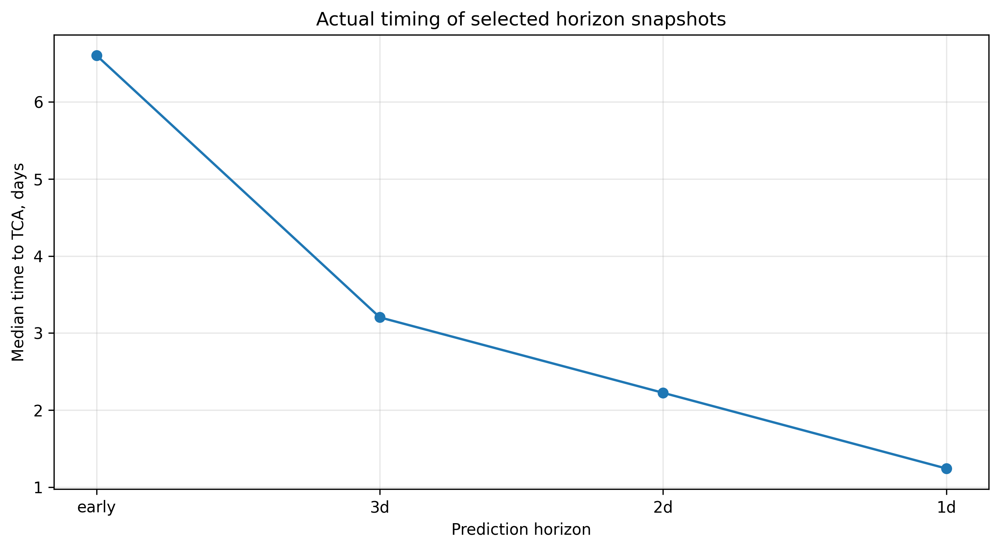

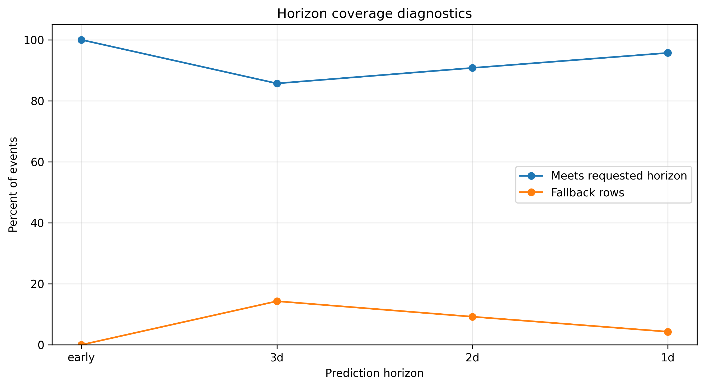

The original plan included a 7-day horizon, but the dataset did not contain valid 7-day snapshots for the events in this split. Instead, BEACON reports an `early` horizon, defined as the earliest available CDM for each event. This is more honest than labeling the earliest available observations as true 7-day predictions.

Preprocessing prefers pre-TCA observations for all horizon snapshots and final label construction. If an event has no pre-TCA observations, the pipeline falls back to an available row and records the selected-row status in `results/horizon_post_tca_diagnostics.csv`. This makes post-TCA fallback behavior explicit rather than silently mixing it into the results.

## 6. Methods

### 6.1 Event-level splitting

Train, validation, and test splits are performed by `event_id`, not by individual CDM row. This prevents observations from the same conjunction event from leaking across splits.

This design rule is critical because each event may have multiple CDM observations. If rows from the same event appeared in both training and test sets, the model could appear to perform well by recognizing event-specific information rather than learning generalizable risk structure.

### 6.2 Baselines and learned models

The study compares four baseline approaches:

- current-risk baseline
- logistic regression
- random forest
- gradient boosting

The **current-risk baseline** ranks events directly by the CDM-provided current risk estimate. This is an important baseline because the existing risk value is already highly informative.

Learned models are allowed to use the current CDM `risk` feature along with the other numeric CDM/context features. Therefore, the intended comparison is not “machine learning without risk versus current risk.” The intended comparison is whether a learned model can improve triage over direct current-risk ranking by combining current risk with additional features.

Final-risk label metadata, including `final_risk` and `final_time_to_tca`, is excluded from model features to avoid label leakage.

### 6.3 Current-risk feature ablation

To make the role of the CDM `risk` feature explicit, BEACON includes a current-risk feature ablation. The ablation compares three policies across the same repeated event-level splits:

- direct current-risk ranking,
- gradient boosting with the current `risk` feature included,
- gradient boosting with the current `risk` feature removed.

This experiment separates two claims. First, it tests whether a learned model can improve over simply sorting by the current risk estimate. Second, it tests whether non-risk CDM/context features contain useful signal when the current risk estimate is unavailable to the learned model.

### 6.4 Calibration

Gradient boosting probabilities are calibrated using sigmoid calibration on the validation split. Calibration is evaluated on held-out test events using:

- Brier score
- Expected Calibration Error
- reliability curves
- quantile-binned reliability curves

Calibration is important because a model can rank events well while still producing probabilities that are poorly aligned with observed event frequencies.

### 6.5 Bayesian and Bayesian-inspired uncertainty estimation

BEACON includes a Laplace-approximated Bayesian logistic regression baseline. This model uses a Gaussian prior, Bernoulli likelihood, MAP estimation, and a local Gaussian posterior approximation. It provides a true Bayesian probabilistic baseline, although it is not the strongest ranking model in the current experiments.

BEACON also uses a bootstrap gradient boosting ensemble as a Bayesian-inspired uncertainty estimator. Multiple gradient boosting models are trained on bootstrapped samples of the training data. For each event, BEACON computes:

- mean predicted probability across ensemble members
- predictive standard deviation across ensemble members

The predictive standard deviation is used as an uncertainty score. Events with the highest uncertainty can be escalated for human review.

The bootstrap ensemble is called **Bayesian-inspired** rather than fully Bayesian because it does not explicitly define priors, likelihoods, or posterior inference over the gradient boosting model. Instead, it approximates uncertainty by measuring disagreement across models trained on plausible resampled versions of the data.

### 6.6 Repeated split robustness

Because high-risk conjunctions are rare, a single fixed test split can be sensitive to which high-risk events appear in the test set. To reduce this risk, BEACON repeats the event-level train/validation/test split across 20 random seeds and reports mean and standard deviation for ranking, calibration, top-K recall, escalation metrics, and risk ablation metrics.

This robustness check changes the interpretation of the results. Rather than relying on a single split, BEACON asks whether the main trends persist across many leakage-safe event-level splits.

### 6.7 Interactive visual analytics viewer

BEACON includes an interactive 3D visual analytics viewer that turns the model outputs into inspectable research cases. The viewer is not an operational propagator. It is a human-AI triage interface for examining how risk, model probability, predictive uncertainty, event geometry, and selected prediction horizon interact for representative conjunction events.

The viewer exports and loads `viewer/data/conjunction_events.json`, which contains the selected events, horizon snapshots, model probability, predictive standard deviation, current and final risk, and the best available display geometry. When absolute target and secondary position columns are available, the viewer uses them directly. When absolute positions are unavailable, it falls back to relative-state, miss-distance, or deterministic reference-orbit approximations and exposes the geometry mode in the UI and exported JSON.

The viewer adds several research controls: event selection, horizon scrubbing, play-through of horizon evolution, camera tracking, target/secondary path overlays, displayed separation, uncertainty proxy volumes, a research-validity guardrail panel, and screenshot/JSON/HTML export modes. These controls support a repeatable demo path: select a high-priority event, scrub across warning horizons, inspect how uncertainty changes, and export a research snapshot.

Because the model exports probability-space predictive standard deviation rather than orbital covariance, uncertainty volumes are explicitly framed as visual proxies. The current visualization maps predictive uncertainty and forecast horizon into a comparative envelope:

```text
sigma_proxy_km = 100 + 1800 * predictive_std + 45 * time_to_tca_days
95_percent_visual_envelope_km = 1.96 * sigma_proxy_km
```

This mapping is intended for visual comparison and human review, not covariance estimation. The viewer also preserves the original `relative_distance_km` when small separations are display-scaled for visibility. A validity watermark and guardrail panel indicate whether the viewer is using exported data or sample/fallback data, the current geometry mode, the display scale, and the research-only constraint.

## 7. Metrics

The primary metrics are:

- ROC-AUC
- PR-AUC
- Brier score
- Expected Calibration Error
- precision at top 1%, 5%, and 10%
- recall at top 1%, 5%, and 10%
- positive escalation rate under uncertainty-based review
- risk-ablation deltas
- repeated-split mean and standard deviation

Accuracy is not emphasized because the positive class is extremely rare.

For rare-event triage, the most important operational question is not whether the model predicts every event correctly. The more important question is whether it helps prioritize the small number of events most deserving of attention.

## 8. Results

### 8.1 Rare-event ranking

Across 20 repeated event-level splits, learned models improve PR-AUC over the current-risk baseline at every evaluated horizon.

| Horizon | Best learned model | Best learned PR-AUC | Current-risk PR-AUC |
| --- | --- | ---: | ---: |
| `1d` | bootstrap gradient boosting ensemble | 0.806 +/- 0.091 | 0.581 +/- 0.085 |
| `2d` | bootstrap gradient boosting ensemble | 0.630 +/- 0.106 | 0.367 +/- 0.083 |
| `3d` | gradient boosting | 0.493 +/- 0.090 | 0.237 +/- 0.048 |
| `early` | gradient boosting | 0.233 +/- 0.082 | 0.109 +/- 0.031 |


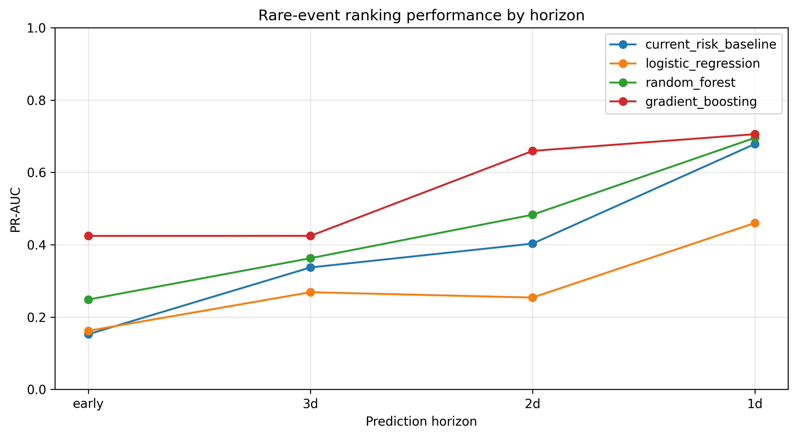

The current-risk baseline remains strong, which is expected. The CDM risk estimate is already a meaningful domain signal. However, the repeated split results show that learned models add ranking value beyond direct current-risk ranking, especially at 1-day, 2-day, and 3-day horizons.

### 8.2 Top-K triage

Top-K recall measures how many high-risk events are captured when reviewing only the highest-ranked events. This is especially relevant for operational triage, where human attention is limited.


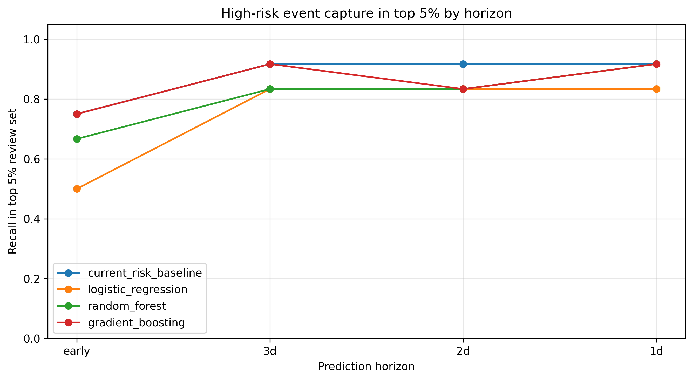

Repeated split top-K results are strong. At the top 5% review level, the bootstrap ensemble captures approximately 97.1% of high-risk events at 1 day, 94.6% at 2 days, 95.0% at 3 days, and 71.3% at the early horizon. This supports the framing of conjunction assessment as a ranking and prioritization problem rather than a standard classification problem.

### 8.3 Probability calibration

Sigmoid calibration preserves ranking performance while improving probability quality. This is expected because calibration mostly adjusts the probability scale rather than changing the ordering of predictions.

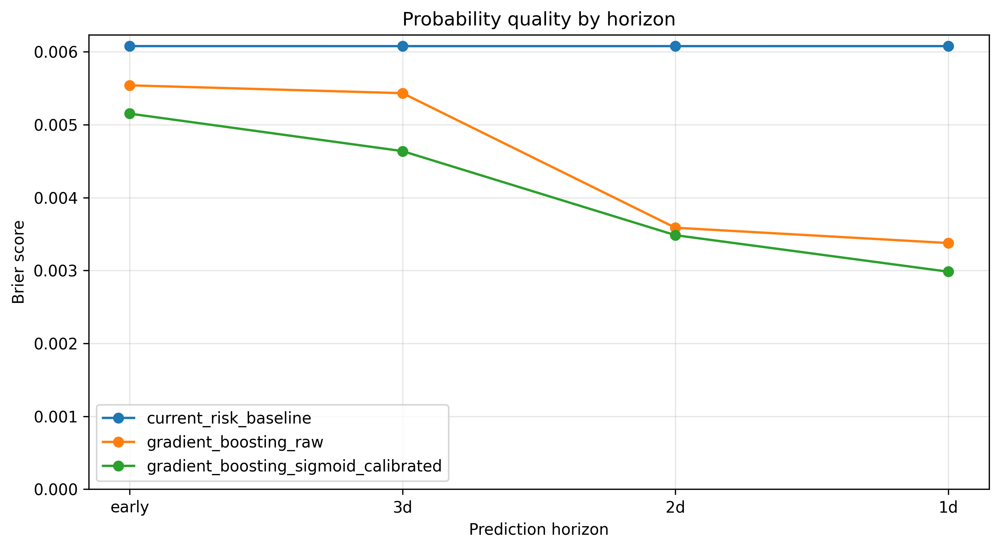

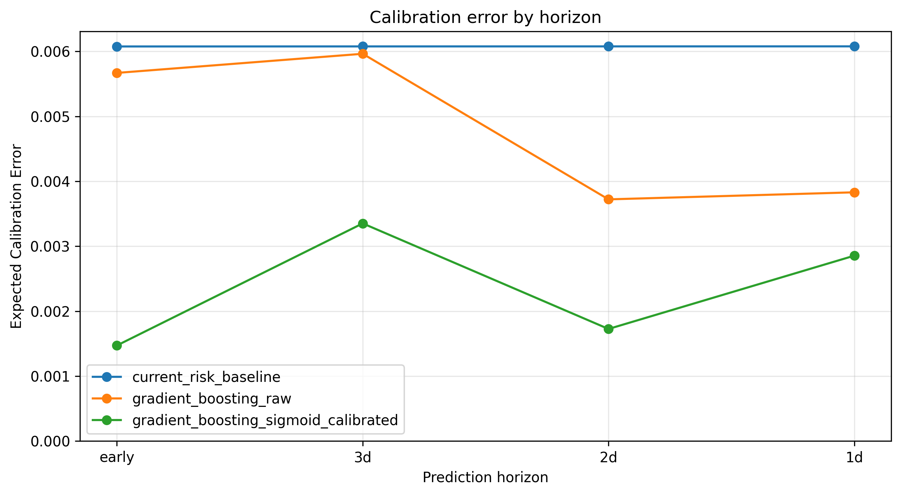

Brier score and Expected Calibration Error improve after calibration across the evaluated horizons. This suggests that calibrated gradient boosting produces probabilities that are more useful for decision support than raw model outputs.

The quantile-binned reliability curves below show calibration behavior across prediction horizons. Quantile binning is useful in this rare-event setting because predicted probabilities are concentrated near zero, making ordinary uniformly spaced reliability bins harder to interpret.

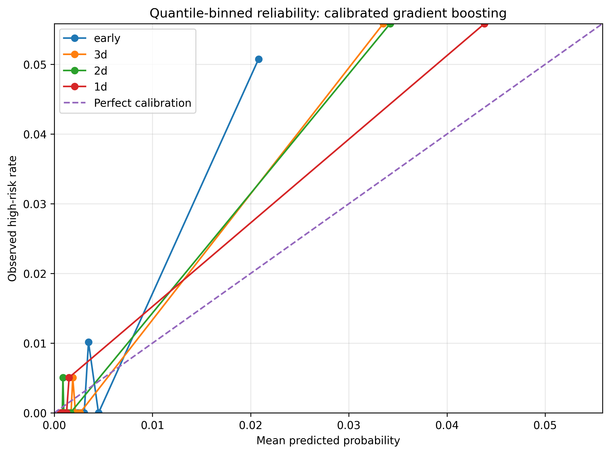

The 1-day reliability comparison below compares the current-risk baseline, raw gradient boosting, and calibrated gradient boosting. This separates ranking performance from probability behavior: a model can rank high-risk events well while still requiring calibration before its probabilities are decision-useful.

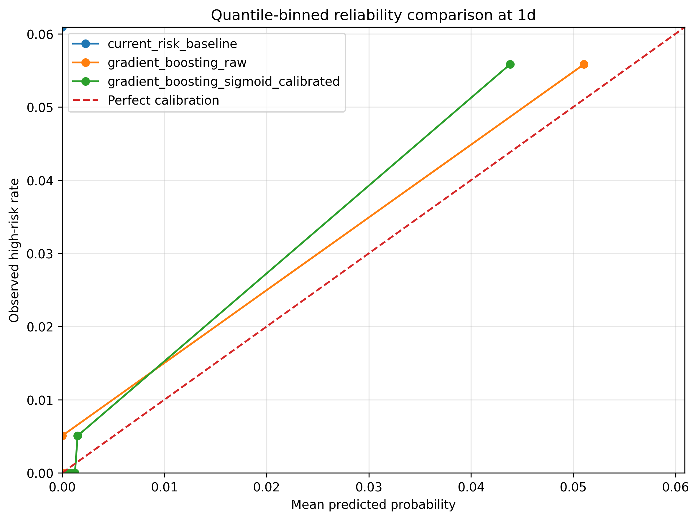

### 8.4 Uncertainty-aware escalation

Bootstrap ensemble uncertainty is strongly concentrated on high-risk events. High-risk events have much larger predictive standard deviation than non-high-risk events.

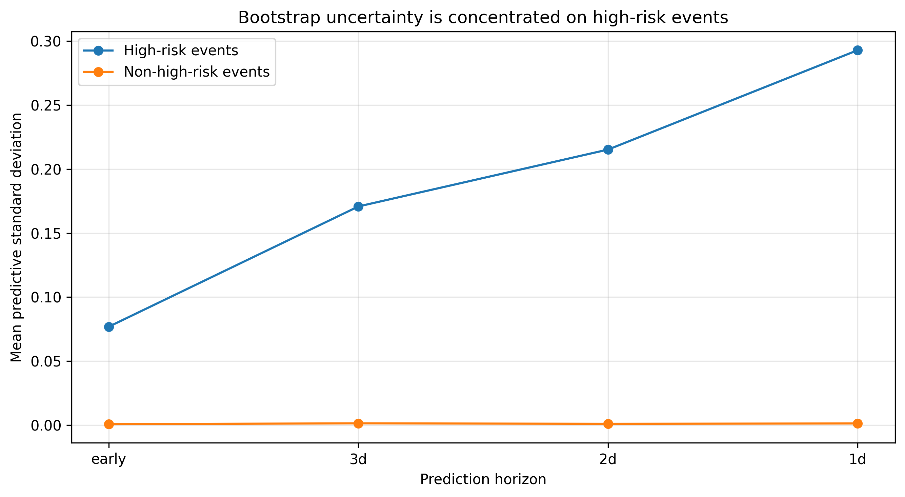

This result suggests that uncertainty itself is a useful triage signal. The model is not merely assigning higher risk to some events; it is also expressing greater uncertainty on events that are more likely to matter.

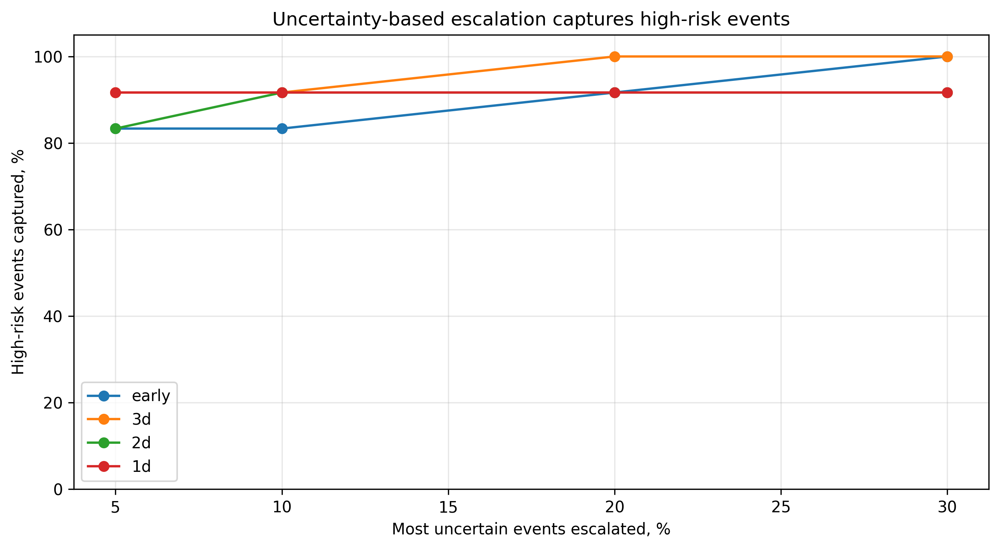

Across 20 repeated event-level splits, uncertainty-based escalation substantially outperforms random escalation. At the 10% escalation level, uncertainty captures:

| Horizon | Uncertainty escalation | Current-risk escalation | Random escalation |
| --- | ---: | ---: | ---: |
| `1d` | 97.5% +/- 3.9% | 99.6% +/- 1.9% | 8.3% +/- 7.2% |
| `2d` | 96.3% +/- 4.3% | 97.9% +/- 3.7% | 9.6% +/- 7.8% |
| `3d` | 97.5% +/- 3.9% | 97.9% +/- 3.7% | 11.3% +/- 10.2% |
| `early` | 80.8% +/- 9.8% | 84.6% +/- 7.8% | 8.3% +/- 6.6% |


The coverage tradeoff shows how many high-risk events are escalated as the automated coverage rate decreases.

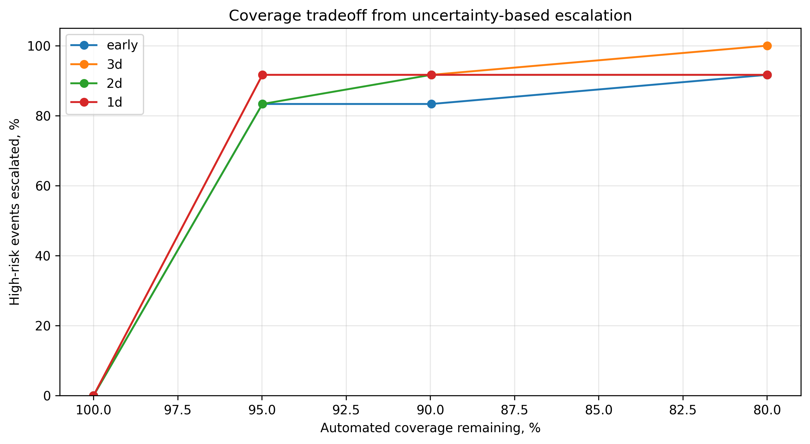

These results should not be interpreted as showing that uncertainty replaces current risk. Current-risk escalation remains an extremely strong baseline, especially near TCA. Instead, the repeated split results support a more careful claim: uncertainty is a complementary human-review signal that performs far above random escalation and remains competitive with current-risk escalation.

### 8.5 Current-risk feature ablation

The current-risk feature ablation clarifies the source of the learned model's ranking gains. Gradient boosting with the current `risk` feature outperforms direct current-risk ranking in PR-AUC at every horizon. Removing the current `risk` feature reduces gradient-boosting PR-AUC at every horizon, but the no-risk model still exceeds direct current-risk PR-AUC.

| Horizon | Current-risk PR-AUC | GB with risk PR-AUC | GB without risk PR-AUC | With risk minus current risk | With risk minus without risk |
| --- | ---: | ---: | ---: | ---: | ---: |
| `1d` | 0.581 +/- 0.085 | 0.739 +/- 0.096 | 0.634 +/- 0.147 | +0.158 +/- 0.119 | +0.105 +/- 0.132 |
| `2d` | 0.367 +/- 0.083 | 0.610 +/- 0.129 | 0.439 +/- 0.107 | +0.243 +/- 0.086 | +0.171 +/- 0.102 |
| `3d` | 0.237 +/- 0.048 | 0.493 +/- 0.090 | 0.379 +/- 0.089 | +0.257 +/- 0.102 | +0.114 +/- 0.127 |
| `early` | 0.109 +/- 0.031 | 0.233 +/- 0.082 | 0.180 +/- 0.066 | +0.123 +/- 0.077 | +0.052 +/- 0.061 |

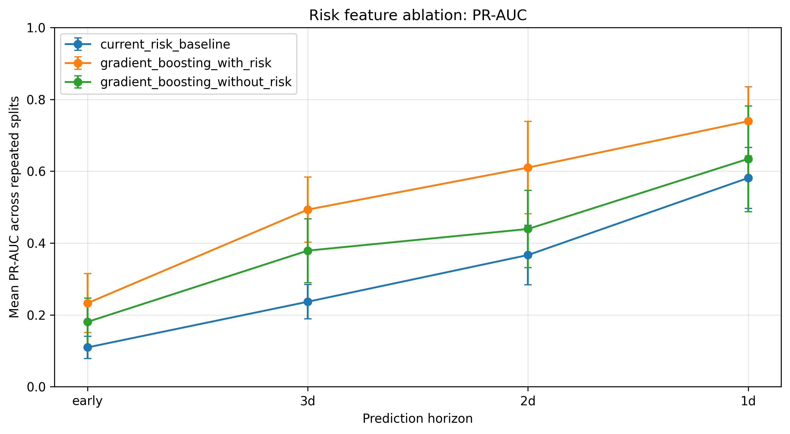

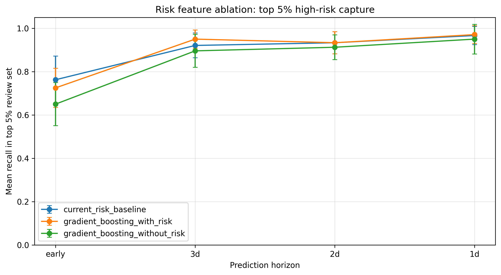

The ablation supports a nuanced interpretation. Current `risk` is an important signal: removing it consistently reduces gradient-boosting PR-AUC. However, the no-risk model still outperforms direct current-risk ranking in PR-AUC, suggesting that additional CDM/context features contain independent ranking signal. At the same time, direct current-risk ranking remains very competitive for top-K recall, especially near TCA. Therefore, the strongest claim is not that machine learning replaces current risk. The stronger and more defensible claim is that learned models can combine current risk with additional features to improve rare-event ranking, while current risk remains a central and operationally meaningful signal.

### 8.6 Repeated split robustness summary

The repeated split analysis strengthens the evidence compared with a single held-out split. The positive class remains small, with about 12 high-risk events per test horizon, but the main qualitative results persist across 20 event-level splits:

1. learned models improve PR-AUC over current-risk ranking at every horizon,
2. top-K recall remains high for learned models,
3. uncertainty escalation greatly outperforms random escalation,
4. current-risk escalation remains a strong, realistic comparator,
5. risk ablation shows that current risk is central but not the only predictive signal,
6. and the viewer provides a research-only interface for inspecting these outputs without hiding geometry or uncertainty caveats.

## 9. Discussion

The results suggest that calibrated and uncertainty-aware machine learning can support rare-event triage in satellite conjunction assessment.

The strongest use case is not replacing operational systems. Instead, BEACON is best understood as a decision-support research framework for prioritizing which events deserve closer human review and for inspecting those priorities through an uncertainty-aware visual analytics interface.

Six findings are especially important.

First, the task is extremely imbalanced, with high-risk events representing less than 1% of events. This makes accuracy an inappropriate primary metric. PR-AUC, top-K recall, calibration, uncertainty-aware escalation, risk ablation, and repeated split robustness are more meaningful.

Second, learned models improve rare-event ranking over the current-risk baseline across repeated event-level splits. This matters because the current-risk baseline is a strong and realistic comparator.

Third, uncertainty-based escalation captures most high-risk events by reviewing only a small fraction of the most uncertain predictions. This suggests that uncertainty estimates can help identify cases where automated prediction should defer to human judgment.

Fourth, current-risk escalation remains extremely strong. This is not a weakness of BEACON. It is an important result: domain risk estimates already contain substantial signal, and learned uncertainty should be used to complement, not replace, domain-informed risk ranking.

Fifth, the risk ablation shows that the current CDM `risk` feature is central to learned-model performance but does not fully explain the learned model's PR-AUC gains. The no-risk model still exceeds direct current-risk PR-AUC, while the with-risk model performs best. This supports an additive-feature interpretation rather than a replacement-of-risk interpretation.

Sixth, the visual analytics viewer changes the artifact from a pure benchmark into an inspectable research system. The viewer makes event selection, horizon evolution, uncertainty, display scaling, data provenance, and non-operational constraints visible instead of leaving them implicit in tables.

## 10. Limitations

This project is a research prototype only.

Key limitations include:

- The number of positive test events is small, even under repeated splits.
- Results are based on public data only.
- The system does not recommend maneuvers.
- The system has not been validated in an operational environment.
- Bootstrap uncertainty is Bayesian-inspired, not fully Bayesian.
- The high-risk threshold is a research definition and not an operational decision rule.
- Learned models include the current CDM risk feature, so results should be interpreted as improvement over direct current-risk ranking, not as risk-free prediction.
- Risk ablation reduces ambiguity about the current-risk feature, but it does not prove that the learned feature relationships would generalize to other datasets.
- Events without pre-TCA observations require fallback handling and are tracked through diagnostics.
- Viewer geometry can use relative-state, miss-distance, or deterministic reference-orbit approximations when absolute positions are unavailable.
- Uncertainty volumes are probability-space visual proxies, not orbital covariance ellipsoids.
- Small separations may be visually scaled for interpretability, although original relative distance is preserved in the exported data.
- The figures, viewer exports, and metrics should be interpreted as preliminary evidence, not deployment-ready validation.

Because each test horizon contains only a small number of high-risk events, strong-looking recall results should still be interpreted cautiously. Repeating the evaluation across 20 event-level splits reduces single-split sensitivity, but it does not replace external validation on independent conjunction assessment data.

## 11. Conclusion

BEACON demonstrates a reproducible framework for evaluating trustworthy AI in satellite conjunction triage.

The project shows that rare-event ranking, calibration, uncertainty-aware escalation, risk-feature ablation, repeated split robustness, and interactive visual analytics provide a more appropriate evaluation lens than accuracy alone. Learned models improve prioritization over direct current-risk ranking across 20 repeated event-level splits. The risk ablation shows that current risk is a central signal, but additional CDM/context features still contain ranking value. Bootstrap ensemble uncertainty identifies many high-risk events for human review and greatly outperforms random escalation, while remaining complementary to strong current-risk escalation. The viewer makes the resulting triage cases inspectable through a research-only interface that exposes horizon evolution, uncertainty proxies, display scaling, and data-validity guardrails.

Future work should add:

- external validation,
- cost-sensitive metrics,
- operationally informed escalation policies,
- true Bayesian nonlinear models,
- richer uncertainty decomposition,
- quantitative user studies of visual triage workflows,
- physically grounded covariance visualization when covariance/state information is available,
- and evaluation on additional conjunction datasets.

BEACON is not an operational collision-avoidance system. It is a research artifact showing how trustworthy machine learning methods and uncertainty-aware visual analytics can be evaluated for high-consequence space-domain decision support.

## Artifact Availability

Code, manuscript source, figures, tests, viewer source, and reproduction scripts for the archived BEACON v0.2.2 research artifact are available through Zenodo at DOI `10.5281/zenodo.21209794` and through the associated GitHub repository. Raw ESA challenge data is not redistributed in the repository and must be obtained according to the original dataset provider's terms.

## References

[Kessler1978] Donald J. Kessler and Burton G. Cour-Palais. Collision Frequency of Artificial Satellites: The Creation of a Debris Belt. *Journal of Geophysical Research*, 1978.

[Uriot2020] Thomas Uriot, Dario Izzo, Luís F. Simões, Rasit Abay, Nils Einecke, Sven Rebhan, Jose Martinez-Heras, Francesca Letizia, Jan Siminski, and Klaus Merz. Spacecraft Collision Avoidance Challenge: Design and Results of a Machine Learning Competition. arXiv:2008.03069, 2020.

[Brier1950] Glenn W. Brier. Verification of Forecasts Expressed in Terms of Probability. *Monthly Weather Review*, 1950.

[Platt1999] John C. Platt. Probabilistic Outputs for Support Vector Machines and Comparisons to Regularized Likelihood Methods. *Advances in Large Margin Classifiers*, 1999.

[NiculescuMizil2005] Alexandru Niculescu-Mizil and Rich Caruana. Predicting Good Probabilities with Supervised Learning. *Proceedings of the International Conference on Machine Learning*, 2005.

[Guo2017] Chuan Guo, Geoff Pleiss, Yu Sun, and Kilian Q. Weinberger. On Calibration of Modern Neural Networks. *Proceedings of the International Conference on Machine Learning*, 2017.

[Gal2016] Yarin Gal and Zoubin Ghahramani. Dropout as a Bayesian Approximation: Representing Model Uncertainty in Deep Learning. *Proceedings of the International Conference on Machine Learning*, 2016.

[Kendall2017] Alex Kendall and Yarin Gal. What Uncertainties Do We Need in Bayesian Deep Learning for Computer Vision? *Advances in Neural Information Processing Systems*, 2017.

[Saito2015] Takaya Saito and Marc Rehmsmeier. The Precision-Recall Plot Is More Informative than the ROC Plot When Evaluating Binary Classifiers on Imbalanced Datasets. *PLOS ONE*, 2015.
